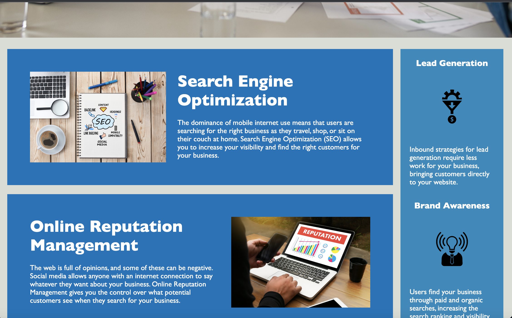

# <Horiseon>

## Description

- My motivation for this project was to use the tools I learned from class and apply them to the website
- I did this project to get more familiar with html and css coding.
- This progect was designed to change html div to semantics.
- I learned how to group similar element together and comment out codes

## Table of Contents (Optional)

- [Installation](#installation)
- [Usage](#usage)
- [Credits](#credits)
- [License](#license)

## Installation

N/A

## Usage

This website was created to help users increase their visibility by optimizing their search engine. The user is also able to use online reputation mangement to give them control over what potential custmers see. This website can help a user determine which platforms are suited for their brand through social media marketing.

## Credits

n/a

## License

n/a

## Badges

n/a

## Features

N/A

## How to Contribute

n/a

## Tests
